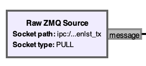
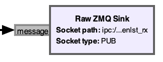
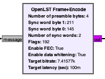
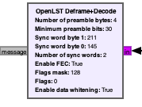

# GNURadio OpenLST Blocks

This repo contains blocks for [GNURadio](https://www.gnuradio.org) that can be used to send and receive packets to an [OpenLST](https://github.com/OpenLST/openlst) device. It includes a GNURadio "Out of Tree (OOT)" Module for the OpenLST as well as an example gnuradio-companion project that can talk to the baseline OpenLST board with cheap SDRs.

This has been tested with an [RTL-SDR](https://www.rtl-sdr.com/about-rtl-sdr/) as a receiver (the RTL-SDR is receive only).

It has also been tested with a [HackRF One](https://greatscottgadgets.com/hackrf/one/) compatible device as a transmitter.

Other SDRs have not been tested but should work.

## Installation

Installing gnuradio, SDR drivers, and these modules can be quite an experience. See the [Install Guide](./INSTALL.md) for tips.

## Blocks

This module contains four blocks:

### Raw ZMQ Source/Sink

GNURadio already has [ZMQ](https://zeromq.org) source and sink blocks. However these blocks only support sending and receiving "PMT" formatted messages. The OpenLST `radio_mux` tool uses ZMQ sockets to send and receive messages in raw byte format. These Raw ZMQ blocks facilitate sending and receiving raw messages.

The source block supports PULL and SUB sockets. A PULL socket can replace the `radio_mux` transmit PUSH socket (defaults to `ipc:///tpm/openlst_tx`).

The sink block supports PUSH and PUB sockets. A PUB can replace the `radio_mux` receive PUB socket (defaults to `ipc:///tpm/openlst_rx`).

## OpenLST Frame+Encode/Deframe+Decode

This block does the bulk of the work converting a raw `radio_mux` message into an RF frame that matches the CC1110's over-the-air format. This message can then be modulated and transmitted to a hardware radio. There are several configuration options. The defaults should match the the OpenLST defaults.

It shares many arguments with the Deframe/Decode block below.

This block does the bulk of the work converting a demodulated RF message in CC1110 format into a `radio_mux` (serial) frame. This includes error correction (if configured).

Common arguments:

**Number of preamble bytes**: The number of bytes of the preamble signal (alternating 1s and 0s). OpenLST default is 32 bits (4 bytes). This is configured in the OpenLST CC1110's `MDMCFG1` setting.

**Sync word byte 1/0**: The sync word is used by the CC1110 to determine the start of a packet. The block default matches the CC1110 and OpenLST default (0xD3 and 0x91), configured in the `RF_SYNC_WORD1` and `RF_SYNC_WORD0` definitions.

**Number of sync words**: The CC1110 can be configured to require multiple copies of the sync word. The OpenLST default is two copies.

**Enable FEC**: If enabled, the output data is encoded with Forward-Error Correction (FEC). See the FEC section below. The default is True, matching the OpenLST's default mode. The OpenLST's ranging mode does not use FEC.

**Enable data whitening**: If enabled, output data is "whitened" to avoid bias in the signal. See the Whitening section below. The OpenLST's modes use whitening.

For the encoder, there are additional parameters:

**Flags**: The flags byte of the message (see below). The OpenLST uses this to determine which UART to forward the command to. The default indicates UART1 (`0x40`) and sets a "Ground" bit (`0x80`) for a combined bitset of `0xC0`. The TX bit is not specified in the OpenLST spec. Because the OpenLST default is half-duplex mode on a single frequency, this is used  to filter out echos on the receive chain from packets send over the transmit chain with a corresponding flags mask. This is not really necessary if you are using different transmit and receive frequencies. It's also not required if you have a good RF switch on your output for the transmitter. But for this demo it elimates echos.

**Target bitrate**: If this is set, the block will attempt to throttle the output data to match the desired bitrate. If set to 0, there will be no throttling and the block will produce unlimited fill data (0s) if there are no packets to encode.

But why though?

Probably a fundamental misunderstanding of gnuradio principles by the author! But this addresses a real problem. The OpenLST bitrates can be fairly low. The default mode is 7415.77bps. GNURadio flowgraphs work by trying to fill input buffers from downstream blocks. The *minimum* size for a buffer is the system memory block size. On many Linux systems this is 4KB. On an M1 Mac, this is 16KB. If this buffer is full when a new packet message arrives, this can be 4-16 seconds(!) of latency before the encoded packet arrives downstream. When the target bitrate is set, the block will throttle fill data to attempt to keep the downstream buffer close to empty without stalling the pipeline.

So what should I do?

If the bitrate is low (<150kbps), it's probably best to set this parameter to match. For high bitrates, it's probably better to set to 0 to avoid underruns.

**Target latency (s)**: If the target bitrate is set (not 0) this parameter determines how much of the downstream buffer to fill. It attempts to keep about the latency target worth of fill in the downstream buffer.

For the decoder, there are additional parameters:

**Minimum preamble bits**: Similar to the `MDMCFG2` register on the CC1110, this sets the minimum number of preamble bits that need to match for the decoder to detect the start of the packet. The default is 30, so 30 out of 32 bits must match the preamble sequence at the start of a packet.

**Flags mask**: A bitmast to apply to the flags byte of incoming messages before checking against the "flags" parameter. This does not affect the flags byte of the message passed along to the next block. Set to 0 to skip checking flags altogether. This is set by default to 0x80 to check the "Ground" bit described above.

**Flags**: The expected value of any flag bits not masked by "Flags mask". Set to 0 by default to ensure the "Ground" bit is unset.

## Example Flowgraph

The sample project contains a flowgraph for a fully functional transceiver. 

### Transmit Chain

Messages arrive on a ZMQ PULL socket from `radio_mux`. Raw byte messages from `radio_mux` are encoded using the OpenLST Frame+Encode.

The CC1110 supports several modulation types. OpenLST's default mode uses GFSK. The framed+encoded data is then modulated using the GFSK modulator block which outputs the modulated symbol at 4 samples/symbol. The modulated output is upsampled match the desired sample/symbol rate. At 1M samples/second with a bitrate of 7415.77bps, this is 134.848 samples/symbol.

The HackRF device outputs a strong peak at the configured frequency, so it is set to 100kHz below the desired center of 437.0MHz at 436.9MHz. To compensate, the signal is shifted up by 100KHz before transmission. Other more expensive SDRs probably don't have this limitation and might not need this workaround, though it does make sense to set the base frequency lower than the center frequency in order to fit the full signal bandwidth.

### Sending and Receiving Messages

Data is sampled from the RTL-SDR at 1M samples/second. The SDR is set to 436.9MHz to match the transmit chain and the resulting stream is shifted down by 100KHz.

A low-pass filter is applied with a 50KHz cutoff to remove noise from outside the receive band. 50KHz is arbitrary here and could probably be tighter or looser, depending on the range of dopper/oscillator variance.

The data is then resampled with a Fractional Resampler block down from 134.848 samples/symbol down to 4 samples/symbol to support the Symbol Sync block which works better on lower sample/symbol rates.

The Symbol Sync block attempts to recover the clock and frequency of the demodulated symbol. The chosen parameters and error detector mode are arbitrary and reflect a complete lack of understanding and interest by the author.

The resulting symbols are then demodulated with the GFSK Demod block and deocded with the OpenLST Decode+Deframe block.

The raw bytes of the packet are sent back to `radio_mux` over a ZMQ socket.

## RF Packet Format

| Preamble | Sync Word(s) | Length | Data | HWID | CRC |

Example:

| Segment | Section    | Example | Description |
| ------- | ---------- | ------- | ----------- | 
| Header  | Preamble   | AA AA AA AA AA AA AA AA | 32 bits of 10101... |
| Header  | Sync Words | D3 91 D3 91 | Two copies of the sync word |
| Data    | Length     | 09 | 9 bytes. For FEC, this is still the number of bytes of the pre-FEC packet. |
| Data    | Flags      | 40 | Indicates the UART to use on the OpenLST (UART1 here) |
| Data    | Data       | CD AB 01 10 | Seqnum = 0xabcd (LSB first), subsys = LST, command = ACK |
| Data    | HWID       | 34 12 | 0x1234  (LSB first) |
| Data    | CRC        | xx xx | CRC-16 of the rest of the Data segment |

## Forward-Error Correction (FEC)

2:1 Viterbi encoding is supported by the CC1110. Additionally, when FEC is enabled, the data is interleaved to avoid bursty errors. The OpenLST uses this encoding mode for its default radio mode. Ranging modes do **not** use FEC. FEC effectively halves the data rate by roughly doubling the packet size.

Only the data segment (length, data, HWID, and CRC) of the packet are encoded. The preamble and sync words are not encoded.

There is a note in the CC1110 datasheet that the chip does not support variable length packets with FEC enabled. In practice this does not appear to be an issue. It's likely that the CC1110 would fail to receive any FEC-encoded packets with a length less than one or two FEC blocks (4-8 bytes). OpenLST messages are all at least 9 bytes.

This module contains both an encoder and decoder, poorly ported to Python from the CC1110 application notes.

## Whitening

A PN9 code can be applied to reduce DC bias in the output signal. This encoding is symmetric (encode == decode). OpenLST modes use whitening.

Only the data segment (length, data, HWID, and CRC) of the packet are encoded. The preamble and sync words are not encoded.

Counterintuitively, FEC is done *after* whitening per the CC1110 spec. This is probably not ideal, but it is the way the CC1110 works.

## CRC

A CRC-16 is computed and appended to RF packets. Packets that do not match the CRC are dropped. This is separate from the CC1110's built in function for an 8-bit CRC (which the OpenLST does not use).

# Purpose and Suitability

Instructions, notes, and code herein are not intended as advice and are not generally suitable for any purpose other than experimenting with the CC1110 in a lab setting.

The goal with this project is to demonstrate the basic primitives required to talk to the CC1110. This includes FEC, Whitening, and basic modulation. All those parts are here for a useful reference.

# TODOs, Missing Features, and Issues

There is a lot of tuning and testing that could improve reliability. I have done no testing with received signal strength or SNR through the SDR chain.

The Python source here could use a lot of cleanup and should be ported to C++ for higher data rate use.

There are still occasional dropped packets, even on solid connections. There are probably optimizations and fixes to be made in the sync/preamble logic.

This repo was generated with gr_modtool. There's a lot of boilerplate, (and a lot more cmake than one would hope) but the core useful bits are under [python/openlst](./python/openlst).

# Copyrights and Licensing

Copyright (C) 2023  Robert Zimmerman

This program is free software: you can redistribute it and/or modify
it under the terms of the GNU General Public License as published by
the Free Software Foundation, either version 3 of the License, or
(at your option) any later version.

This program is distributed in the hope that it will be useful,
but WITHOUT ANY WARRANTY; without even the implied warranty of
MERCHANTABILITY or FITNESS FOR A PARTICULAR PURPOSE.  See the
GNU General Public License for more details.

You should have received a [copy](./LICENSE) of the GNU General Public License
along with this program.  If not, see <https://www.gnu.org/licenses/>.

# Conclusion

This publication can be referenced at https://github.com/rzimmerman/gr-openlst.

Special thanks to Sydney Marler and Kyle Colton for their previous work.
